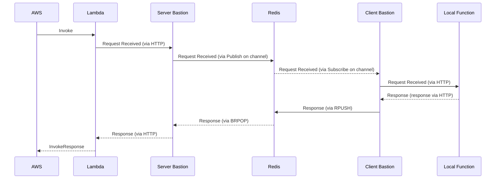
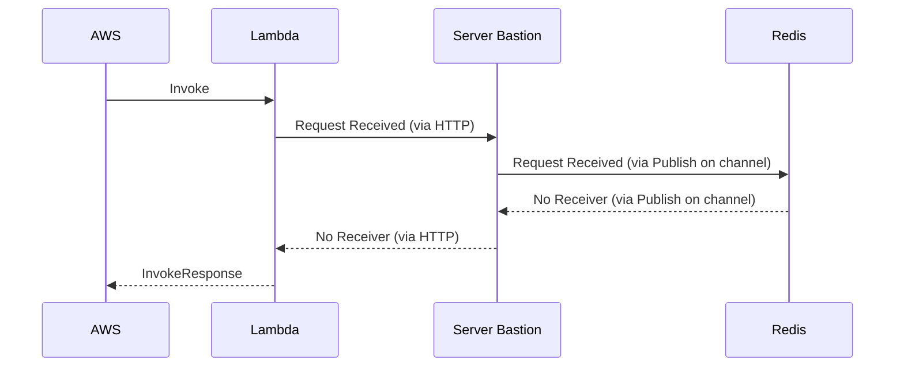

# Funcie

Funcie streamlines local development for AWS Lambda and other serverless functions by enabling you to run and debug your code locally, while still being invoked by AWS. Funcie exists due to frustrations with the local development process in AWS, in particular wanting to avoid emulating complex data pipelines locally or waiting for deployments to test changes.

## Table of Contents

- [Key Features](#key-features)
- [Getting Started](#getting-started)
  - [Prerequisites](#prerequisites)
  - [Setup](#setup)
- [Examples](#examples)
- [Accessing VPC Resources](#accessing-vpc-resources)
- [Cleaning Up](#cleaning-up)
- [Security Considerations](#security-considerations)
- [How Funcie Works](#how-funcie-works)
- [Feedback](#feedback)
- [License](#license)

## Key Features

- **Seamless Integration**: Automatically redirects requests to your local environment when running, without altering your cloud setup or deployments.
- **Flexible Invocation**: Compatible with any AWS Lambda triggers (S3 events, Step Functions, etc.).
- **Language Support**: Currently supports Go and JavaScript/TypeScript, with more languages to come.
- **No Dependency on Development Tools**: Use your preferred IDE or editor.
- **Rapid Iteration**: Run your local code without needing to deploy to AWS for every change.

## Getting Started

Getting started with the CLI takes about 15 minutes.

> **⚠️ Warning**: Once you run `funcie init`, resources will be spun up in your AWS account that total ~$20-25 USD/month. To prevent that cost, be sure to run `funcie destroy` when you're done.

### Prerequisites

- **Go 1.21 or later**
- **AWS CLI** configured
- **Terraform** installed

### Setup

1. **Clone the Repository**

    ```bash
    git clone git@github.com:Kapps/funcie.git
    ```

2. **Install the Funcie CLI**

    ```bash
    cd funcie/cmd/cli
    go install
    ```

3. **Initialize Funcie**

    Deploy the necessary infrastructure to your AWS account.

    ```bash
    funcie init
    ```

    _If you encounter a file not found error, ensure your `PATH` environment variable is set for `go install`. Alternatively, run the CLI from the `cli` folder._

4. **Connect Funcie**

    Create a tunnel for funcie to connect to your AWS instance.

    ```bash
    funcie connect
    ```

5. **Update Your Lambda Handler**

    Modify your Lambda function to use funcie (or run an example from the `examples` folder instead).

    **For Go**:

    1. Install the library:

        ```bash
        go get github.com/Kapps/funcie
        ```

    2. Update your Lambda Start method.

        ```go
        import "github.com/Kapps/funcie/clients/go/funcietunnel"
    
        func main() {
            funcietunnel.Start("my-app", handlerFunc)
        }
        ```

    **For JavaScript/TypeScript**:

    1. Install the library:

        ```bash
        npm install @funcie/client
        ```
    
    2. Update your Lambda handler function.
    
        ```javascript
        const { lambdaWrapper } = require('@funcie/client');
    
        exports.handler = lambdaWrapper("my-app", handlerFunc);
        ```

6. **Run Your Lambda Locally**

    - Start your Lambda function locally using your preferred method.
    - Trigger your Lambda within AWS.
    - You should see logs indicating that funcie is redirecting requests to your local instance.
         
## Examples

Explore the `examples` directory in the funcie repository for sample projects and additional guidance. Each example contains a reasonable starting point for a new Lambda if you wish to use it as a template.

## Accessing VPC Resources

If your Lambda function interacts with resources inside a VPC (e.g., private RDS instances, ElastiCache clusters), `funcie connect` allows your local environment to securely access these resources without a VPN.

For example, to connect to an RDS instance:

```bash
funcie connect -r your-rds-endpoint -p 5432 -l 5432
```

This forwards your local port `5432` to the RDS instance, allowing you to interact with it via `localhost:5432`.

## Cleaning Up

To prevent unnecessary AWS charges, destroy the funcie infrastructure when you're done:
    
```bash
funcie destroy
```

## Security Considerations

Funcie is designed for development and staging environments. It's **not recommended** to use funcie in production due to potential overhead and security considerations.

- **Disable Funcie in Production**:

    - Use environment variables or configuration settings to switch between funcie and the standard Lambda handler.

    - Example in Go:

        ```go
        import (
            "os"
            "github.com/aws/aws-lambda-go/lambda"
            "github.com/Kapps/funcie/clients/go/funcietunnel"
        )

        func main() {
            if os.Getenv("USE_FUNCIE") == "true" {
                funcietunnel.Start("my-app", handler)
            } else {
                lambda.Start(handler)
            }
        }
        ```

## How Funcie Works

Funcie sets up a communication tunnel between your cloud-invoked Lambda functions and your local environment.

When your Lambda function is invoked by AWS:

- **If your local environment is connected**: The funcie handler intercepts the request and forwards it to your local function for processing.
- **If not connected**: The Lambda function runs in the cloud as usual.

This approach allows you to:

- Debug and test your functions locally without changing how they're triggered.
- Use real AWS services and triggers (like S3 events) during development.
- Seamlessly switch between local and cloud execution.

The CLI tool abstracts away much of the complexity of setting up the tunnel, but if you prefer to not use the CLI, you can use the [Terraform Module](https://registry.terraform.io/modules/Kapps/funcie/aws/latest) to set up the infrastructure. You will need to be connected to a VPN for this approach. Generally this might be a better approach for full development teams where you want to automate the setup of the tunnel.

### Message Flows

#### Successful Forward



#### No Receiver



## Feedback

Funcie is a brand new project, and we'd love to hear any feedback you have. Please open an issue on the [GitHub issue tracker](https://github.com/Kapps/funcie/issues) with any comments or if you encounter any issues.

## License

Funcie is released under the [MIT License](LICENSE).
